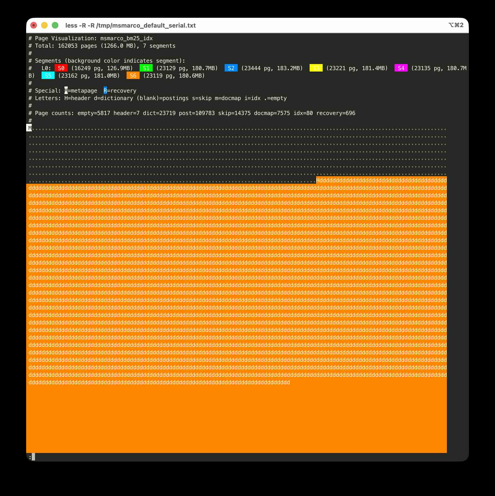

# Debugging Tools

This document describes debugging and diagnostic tools for pg_textsearch
development.

## Page Layout Visualization

The `bm25_debug_pageviz()` function generates an ANSI-colored visualization
of the index page layout. This is useful for understanding how pages are
allocated across segments, identifying fragmentation, and debugging index
size issues.

### Usage

```sql
SELECT bm25_debug_pageviz('index_name', '/tmp/output.txt');
```

View the output with a terminal that supports ANSI colors:

```sh
less -R /tmp/output.txt
# or
cat /tmp/output.txt
```

### Output Format



The visualization shows one character per 8KB page:

**Background colors** indicate which segment owns each page. Each segment
gets a distinct color from a 16-color palette.

**Letters** indicate the page type:
- `M` - Metapage (index metadata, always page 0)
- `R` - Recovery page (crash recovery docid chain)
- `H` - Segment header
- `d` - Dictionary (term strings and offsets)
- (blank) - Posting lists (bulk of the data)
- `s` - Skip index (block-level upper bounds for BMW)
- `m` - Document map (fieldnorms and CTID mapping)
- `i` - Page index (maps logical to physical pages)
- `.` - Empty/unused page

**Header information** includes:
- Total pages and size
- Segment list with level, page count, and size
- Page type counts
- Utilization percentage

### Example: Serial vs Parallel Build

The visualization is particularly useful for comparing serial and parallel
builds. Here's output from MS-MARCO (8.8M documents):

**Serial build** (1266 MB, 96% utilization):
```
# Total: 162053 pages (1266.0 MB), 7 segments
# Page counts: empty=5817 header=7 dict=23719 post=109783 ...
```
Segments are contiguous with minimal wasted space.

**Parallel build** (4000 MB, 30% utilization):
```
# Total: 511957 pages (3999.7 MB), 1 segments
# Page counts: empty=360587 header=1 dict=14410 post=119368 ...
```
The page pool pre-allocation leaves 360K empty pages (70% wasted).

### Interpreting the Output

**Healthy serial build**: Pages are contiguous within each segment. Segments
appear as solid blocks of color. Few empty pages.

**Fragmented parallel build**: Segments interleave with large gaps of empty
pages. This indicates the page pool was over-allocated or not reclaimed.

**Many small segments**: If you see many segment headers (`H`) interspersed,
the spill threshold may be too low, causing excessive segmentation.

## Other Debug Functions

### bm25_summarize_index

Quick statistics without dumping content:

```sql
SELECT bm25_summarize_index('index_name');
```

Returns corpus stats, memory usage, segment counts, and index size.

### bm25_dump_index

Detailed internal structure dump:

```sql
-- Truncated output for quick inspection
SELECT bm25_dump_index('index_name');

-- Full dump to file (includes posting lists, useful for debugging)
SELECT bm25_dump_index('index_name', '/tmp/dump.txt');
```

### bm25_spill_index

Force the memtable to spill to disk:

```sql
SELECT bm25_spill_index('index_name');
```

Returns the number of posting entries spilled. Useful for testing segment
creation without waiting for automatic spill threshold.
